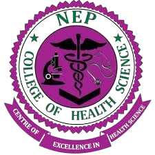

<html lang="en">
<head>
  <meta charset="UTF-8" />
  <meta name="viewport" content="width=device-width, initial-scale=1.0"/>
  <title>Garissa County Referral Hospital</title>
  
</head>
<body>
    <!DOCTYPE html>
<html lang="en">
<head>
  <meta charset="UTF-8" />
  <meta name="viewport" content="width=device-width, initial-scale=1.0" />
  <title>Background Slideshow</title>
  
</head>
<body>

  

    

    

    

    

    

    

  

  

</body>
</html>

  <header>
    
    <h1>Garissa County Referral Hospital</h1>
  </header>

  </header>

<nav class="main-nav">
  <ul class="nav-menu">
    <li><a href="#">Home</a></li>
    <li>
      <a href="#">Our Services</a>
      <ul class="dropdown">
        <li>
          <a href="#">Clinical Services</a>
          <ul class="dropdown">
            <li><a href="#">Surgical Services</a></li>
            <li><a href="#">Medical Services</a></li>
            <li><a href="#">Diagnostic Services</a></li>
            <li><a href="#">Pharmaceutical Services</a></li>
            <li><a href="#">Nursing Services</a></li>
            <li><a href="#">Specialized Clinics</a></li>
            <li><a href="#">Schedule</a></li>
          </ul>
        </li>
        <li><a href="#">Centers Of Excellence</a></li>
        <li><a href="#">Medical Research & Programs</a></li>
        <li><a href="#">Patient Affairs</a></li>
        <li><a href="#">Covid-19 Centre</a></li>
      </ul>
    <li class="nav-item dropdown">
  <a href="#" class="nav-link">About Us</a>
  <ul class="dropdown-menu">
    <li><a href="#history" class="dropdown-item">Our History</a></li>
    <li><a href="#whoweare" class="dropdown-item">Who We Are</a></li>
    <li><a href="#directorates" class="dropdown-item">Directorates</a></li>
    <li><a href="#management" class="dropdown-item">Management</a></li>
    <li><a href="#milestones" class="dropdown-item">Milestones</a></li>
    <li><a href="#careers" class="dropdown-item">Careers</a></li>
    <li><a href="#tenders" class="dropdown-item">Tenders</a></li>
  </ul>
</li>
     <li class="nav-item dropdown">
  <a href="#" class="nav-link">Departments</a>
  <ul class="dropdown-menu">
    <li><a href="#">Clinical Services Department</a></li>
    <li><a href="#">Nursing Services Department</a></li>
    <li><a href="#">Pharmaceutical Services Department</a></li>
    <li><a href="#">Diagnostic Services Department</a></li>
    <li><a href="#">Public Health & Preventive Services</a></li>
    <li><a href="#">Health Information Management</a></li>
    <li><a href="#">ICT Department</a></li>
    <li><a href="#">Admin & HR Department</a></li>
    <li><a href="#">Finance & Accounts</a></li>
    <li><a href="#">Procurement & Supply Chain</a></li>
    <li><a href="#">Engineering & Maintenance</a></li>
    <li><a href="#">Support Services</a></li>
    <li><a href="#">Media & Communication</a></li>
  </ul>
</li>
  <a href="#">Gallery / Media Center</a>
  <ul class="dropdown">
    <li><a href="#">Photos</a></li>
    <li><a href="#">Videos</a></li>
    <li><a href="#">Press Releases</a></li>
    <li>
      <a href="#">Newsletters</a>
      <ul class="dropdown">
        <li><a href="#">Monthly Reports</a></li>
        <li><a href="#">Blogs</a></li> <!-- New link added here -->
      </ul>
    </li>
  </ul>
</li>
  </ul>
</nav>

  

 <!-- Statistics Section -->

  <h2 style="text-align: center; color: #063970; font-size: 36px; font-weight: 700; margin-bottom: 60px; letter-spacing: 1px;">
    Hospital At a Glance
  </h2>
  

    
    <!-- Stat Box -->
    

      
🛏️

      <h3 style="margin-top: 20px; font-size: 20px; color: #063970; font-weight: 600;">Bed Capacity</h3>
      
500

    

    <!-- Stat Box -->
    

      
👩‍⚕️

      <h3 style="margin-top: 20px; font-size: 20px; color: #063970; font-weight: 600;">Employees</h3>
      
500

    

    <!-- Stat Box -->
    

      
📅

      <h3 style="margin-top: 20px; font-size: 20px; color: #063970; font-weight: 600;">Years of Service</h3>
      
60

    

    <!-- Stat Box -->
    

      
🏥

      <h3 style="margin-top: 20px; font-size: 20px; color: #063970; font-weight: 600;">Specialized Clinics</h3>
      
22

    

  

   <!-- Management Section -->

  <h2 style="text-align: center; font-size: 36px; color: #0a4275; margin-bottom: 60px; font-weight: bold;">Meet Our Leadership</h2>
  

    
    

      
      <h3 style="margin-bottom: 10px; font-size: 22px; color: #0a4275;">Bashir Gure Gedi</h3>
      
Chair, Board of Management

    

    

      
      <h3 style="margin-bottom: 10px; font-size: 22px; color: #0a4275;">Mahat Salah Sheikh</h3>
      
Chief Executive Officer

    

    

      
      <h3 style="margin-bottom: 10px; font-size: 22px; color: #0a4275;">Dr Hussein Buro</h3>
      
Director - Clinical Services

    

  

 <!-- ...everything above remains unchanged... -->

 <!-- Our Partners Section -->
<section style="background-color: #f8f9fa; padding: 60px 20px; font-family: Arial, sans-serif;">
  

    <h2 style="color: #0a4275; font-size: 32px; margin-bottom: 40px;">Our Trusted Partners</h2>
    

      <a href="https://garissa.go.ke" target="_blank" style="text-decoration: none;">
        

          
          
Garissa County

        

      </a>

      <a href="https://www.icrc.org" target="_blank" style="text-decoration: none;">
        

          
          
ICRC

        

      </a>

      <a href="https://www.kmtc.ac.ke" target="_blank" style="text-decoration: none;">
        

          
          
KMTC

        

      </a>

     <a href="https://www.amref.org" target="_blank" style="text-decoration: none;">
        

          
          
Amref Health Africa

        

      </a>
      <a href="https://www.nepcollege.ac.ke" target="_blank" style="text-decoration: none;">
  

    
    
NEP College

  

</a>

    

  

</section>

<!-- Services Section -->

  <h2 style="text-align: center; color: #0a4275; font-size: 36px; margin-bottom: 40px; font-weight: bold;">Our Services</h2>
  
  

    <!-- Service Card -->
    

      <h3 style="color: #0a4275; font-size: 22px; margin-bottom: 15px;">Surgical</h3>
      
GCRH conducts numerous major and minor surgeries and brings together multidisciplinary faculty and staff to enhance patient care and research.

    

    <!-- Service Card -->
    

      <h3 style="color: #0a4275; font-size: 22px; margin-bottom: 15px;">Medical</h3>
      
We manage services including Pediatrics, Cardiology, Mental Health, Nutrition, Oncology, Renal, Infectious Diseases, Diabetes, and more.

    

    <!-- Service Card -->
    

      <h3 style="color: #0a4275; font-size: 22px; margin-bottom: 15px;">Diagnostics</h3>
      
Radiology, laboratory testing, farewell services, and health information systems support our commitment to clinical excellence.

    

    <!-- Service Card -->
    

      <h3 style="color: #0a4275; font-size: 22px; margin-bottom: 15px;">Pharmaceutical</h3>
      
Our pharmaceutical services include clinical pharmacy, pharmacovigilance, drug information, and in-house production of medications.

    

  

  <!-- CTA Button -->
  

    <a href="#" style="background-color: #0a4275; color: white; padding: 14px 30px; border-radius: 30px; text-decoration: none; font-weight: bold; font-size: 16px; transition: background-color 0.3s;">SEE MORE SERVICES</a>
  

<!-- Hover effect using inline 

 <!-- Social Media Channels Section -->

  <h2 style="color: #ffffff; text-align: center; font-size: 2.75rem; margin-bottom: 3rem; font-weight: 700; letter-spacing: 1.2px; text-transform: uppercase; text-shadow: 0 2px 4px rgba(0,0,0,0.4);">
    Connect With Us
  </h2>

  

    

      
      <a href="https://facebook.com" target="_blank">Facebook</a>
    

    

      
      <a href="https://twitter.com" target="_blank">X (Twitter)</a>
    

    

      
      <a href="https://youtube.com" target="_blank">YouTube</a>
    

    

      
      <a href="https://rgk.co.ke/top-stories/34282/garissa-referral-hospital-secures-sustainable-drug-supply-system-ceo-mahat" target="_blank">News Portal</a>
    

  

 <!-- Testimonials Section -->
<section class="testimonials-section" style="background: rgba(255, 255, 255, 0.3); backdrop-filter: blur(10px); padding: 5rem 1.5rem; color: #1c1c1c; text-align: center; border-radius: 20px; margin-top: 3rem; box-shadow: 0 10px 30px rgba(0,0,0,0.15);">
  <h2 style="font-size: 2.5rem; font-weight: 700; margin-bottom: 3rem; letter-spacing: 1px; color: #003c2f;">What Our Clients Say</h2>

  

    

      <!-- Testimonial 1 -->
      

        
<strong style="color: #0d6efd;">@devis mumo</strong> 
        <em>device mumo</em> 
        “Congratulations and may God bless you.”

      

      <!-- Testimonial 2 -->
      

        
<strong style="color: #0d6efd;">@Halima jelle</strong> 
        <em>halima jelle jamac</em> 
        “Having gone to different hospitals and not getting help, we landed at GCRH. My son was admitted and had major surgery. After staying in ward 1E and receiving amazing follow-up care, our miracle boy is now in his final year of university. The oncology doctors are the best.”

      

      <!-- Testimonial 3 -->
      

        
<strong style="color: #0d6efd;">@Daud Hareth</strong> 
         <em>daud hareth</em> 
        “We value your service, keep up!”

      

      <!-- Testimonial 4 -->
      

        
<strong style="color: #0d6efd;">ramazan@254</strong> 
        “I just want to thank God for the treatment I received. Doctors and nurses went out of their way. Be blessed beyond expectations.”

      

      <!-- Testimonial 5 -->
      

        
<strong style="color: #0d6efd;">betrice awour</strong> 
        “I appreciate your medics so much. My son is back to normal. ENT team, thank you!”

      

      <!-- Testimonial 6 -->
      

        
<strong style="color: #0d6efd;">diriye@26</strong> 
        “The best hospital in Kenya.”

      

    

  

</section>

</head>
<body>

  <!-- Footer -->
  <footer>
    

      <!-- Contact Info -->
      

        <h4>Contact Us</h4>
        
<strong>Garissa County Referral Hospital</strong>

        
P.O. Box 29 - 70100, Garissa, Kenya

        
Email: garissapgh@yahoo.com

        
Phone: +254 720 705 683

      

      <!-- Quick Links -->

  <h4>Quick Links</h4>
  <ul>
    <li><a href="#">Home</a></li>
    <li><a href="#">Departments</a></li>
    <li><a href="#">Doctors</a></li>
    <li><a href="#">Contact</a></li>
    <li><a href="https://webmail.healthgarissa.go.ke" target="_blank">Staff Mail</a></li>
    <li><a href="https://afyayangu.go.ke/#/registration" target="_blank">Register SHA</a></li>
  </ul>

      <!-- Mission & Vision -->
      

        <h4>Our Vision</h4>
        
A centre of excellence in provision of accessible, affordable and socially acceptable quality health care services in the region and beyond.

        <h4>Our Mission</h4>
        
To build a progressive, responsive and sustainable health system offering promotive, preventive, curative and rehabilitative services.

      

      <!-- Core Values -->
      

        <h4>Core Values</h4>
        <ul>
          <li>Efficiency & Effectiveness</li>
          <li>Compassion</li>
          <li>Inclusivity & Equity</li>
          <li>Professionalism</li>
          <li>Accountability & Integrity</li>
          <li>Innovation</li>
          <li>Team Work</li>
        </ul>
      

    

    

      &copy; 2025 Garissa County Referral Hospital. All Rights Reserved.
    

  </footer>

</body>
</html>

